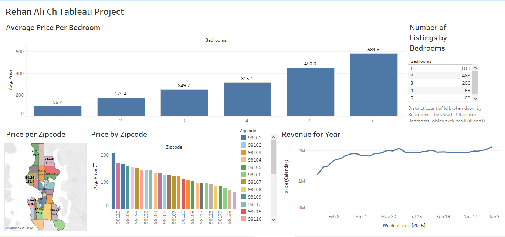

# Airbnb Tableau Market Analysis

This repository features a Tableau dashboard that analyzes Airbnb listings, rental prices, location patterns, and revenue trends. It showcases how Tableau can turn listing data into clear, interactive business insights.

### Live Dashboard
[View the full dashboard](https://public.tableau.com/app/profile/rehan.ali.ch/viz/RehanAliChsAirbnbFullProjectinTableau/Dashboard2?publish=yes)

## Tableau Dashboard

### Overview
This Tableau project by Rehan Ali provides insights into Airbnb listings, focusing on average rental prices, geographic distribution, listing mix, and revenue performance.

#### Key Insights
- Average Price Per Bedroom: Prices increase with the number of bedrooms.
- Number of Listings by Bedrooms: Distribution of listings categorized by bedroom count.
- Price by Zipcode: Variation in average prices across different zip codes.
- Revenue for Year (2016): Track revenue trends throughout 2016.

#### How to Use
Open the Tableau workbook or use the Tableau Public dashboard link below to explore Airbnb market trends and identify pricing, location, and revenue opportunities.

### Dashboard 

